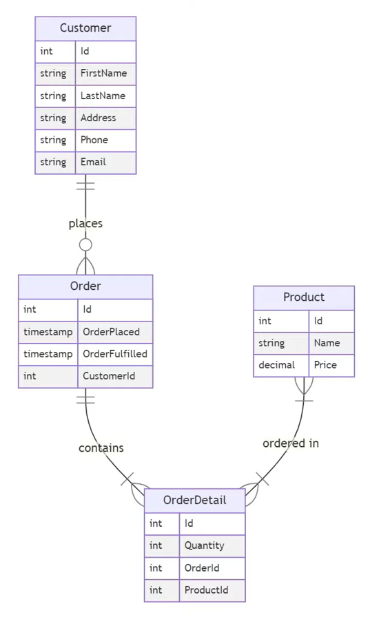

# Ecommerce EF Core Project

## Ecommercer DB Image schema

(

1. Create a new project in Visual Studio					
1	. select console app
1. Add the following NuGet packages to the project:
	1. Microsoft.EntityFrameworkCore
	1. Microsoft.EntityFrameworkCore.SqlServer
	1. Microsoft.EntityFrameworkCore.Tools
1. Create a folder called Models and 3 classes inside it Product,Order,Customer, OrderDetail
1. Create a folder called Data and a class called EcommerceContext inside it

1. Create a new class called `Product` with the following properties:
	
        using System.ComponentModel.DataAnnotations;
        using System.ComponentModel.DataAnnotations.Schema;

        namespace ecommerceDemo.Models
        {
            public class Product
            {
                [Key] // This is the primary key
                [DatabaseGenerated(DatabaseGeneratedOption.Identity)]  // This is an auto-incrementing field
                public int Id { get; set; }
                public string Name { get; set; } = null!; // null-forgiving operator

                [Column(TypeName ="decimal(6,2)")] // 2 decimal places, 6 digits
                public decimal Price { get; set; }
            }
         }

1. Create a new class called `Order` with the following properties:

	    using System.ComponentModel.DataAnnotations;
        using System.ComponentModel.DataAnnotations.Schema;

        namespace ecommerceDemo.Models
        {
            public class Order
            {
                [Key]
                [DatabaseGenerated(DatabaseGeneratedOption.Identity)]
                public int Id { get; set; }
                public DateTime OrderPlaced { get; set; }
                public DateTime OrderFulfilled { get; set; }
                public int CustomerID { get; set; } //foreign key which if ommited ef core will create it anyway as  a shadow property
                public Customer Customer { get; set; } = null!; //navigation property : one custmer per order(one to one)
                public ICollection<OrderDetail> OrderDetails { get; set; } = null!; //navigation property : one to many
            }
        }

1. Create a new class called `Customer` with the following properties:

	    using System.ComponentModel.DataAnnotations.Schema;
        using System.ComponentModel.DataAnnotations;

        namespace ecommerceDemo.Models
        {
            public class Customer
            {
                [Key]
                [DatabaseGenerated(DatabaseGeneratedOption.Identity)]
                public int Id { get; set; }
                [Required]
                [MaxLength(50)]
                public string FirstName { get; set; } = String.Empty;
                [Required]
                [MaxLength(50)]
                public string LastName { get; set; } = String.Empty;        
                [MaxLength(50)]
                public string? Address { get; set; }
                [MaxLength(20)]
                public string? Phone { get; set; }
                public string? Email { get; set; }  
                public ICollection<Order> Orders { get; set; } = null!; //navigation property : one to many
            }
        }

1. Create a new class called `OrderDetail` with the following properties:

        using System.ComponentModel.DataAnnotations.Schema;
        using System.ComponentModel.DataAnnotations;

        namespace ecommerceDemo.Models
        {
            public class OrderDetail
            {
                [Key]
                [DatabaseGenerated(DatabaseGeneratedOption.Identity)]
                public int Id { get; set; }
                public int Quantity { get; set; }
                public int ProductId { get; set; } //foreign key which if ommited ef core will create it anyway as  a shadow property
                public int OrderId { get; set; } //foreign key which if ommited ef core will create it anyway as  a shadow property
                public Order Order { get; set; } = null!; //navigation property : one order per order detail(one to one)
                public Product Product { get; set; } = null!; //navigation property : one product per order detail(one to one)

            }
        }

1. Create a new class called `EcommerceContext` that inherits from `DbContext`

	       public class EcommerceContext : DbContext
           {
              public DbSet<Customer> Customer { get; set; } = null!; // match the name of the table in the database
              public DbSet<Order> Order { get; set; } = null!; // match the name of the table in the database
              public DbSet<Product> Product { get; set; } = null!; // match the name of the table in the database
              public DbSet<OrderDetail> OrderDetail { get; set; } = null!; // match the name of the table in the database

              protected override void OnConfiguring(DbContextOptionsBuilder optionsBuilder)
              {
                optionsBuilder.UseSqlServer("Server={servername,port;Initial Catalog=ecommercedb;Persist Security Info=False;User ID={adminname};Password=YourStrong!Passw0rd;MultipleActiveResultSets=False;Encrypt=True;TrustServerCertificate=False;Connection Timeout=30;");
              }

            }
1. Run the following commands in the Package Manager Console:
          
	    Add-Migration InitialCreate      
	    Update-Database
